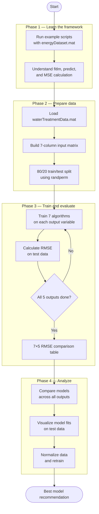

# Data-driven Models for Wastewater Treatment Plant

A MATLAB project that uses supervised learning to model and predict wastewater treatment plant outputs from sensor data.

## Overview

We train and compare 7 supervised learning algorithms on real WWTP sensor data to predict water quality metrics like dissolved oxygen, nitrate, and ammonium concentrations.

## Algorithms Used

- Linear Regression (`fitlm`)
- Generalized Linear Regression (`fitglm`)
- Gaussian Process Regression (`fitrgp`)
- Support Vector Machine (`fitrsvm`)
- Decision Tree (`fitrtree`)
- Ensemble of Learners (`fitrensemble`)
- Generalized Additive Model (`fitrgam`)

## Inputs and Outputs

**Inputs:** `Q_inf`, `Q_air_1`, `Q_air_2`, `Q_air_3`, `Q_air_4`, `Q_air_5`, `Temp`

**Outputs:** `DO_1`, `DO_2`, `DO_3`, `NO3`, `NH4`

## Team
Soham Bhagat, Jason Ta, Alona Dhal